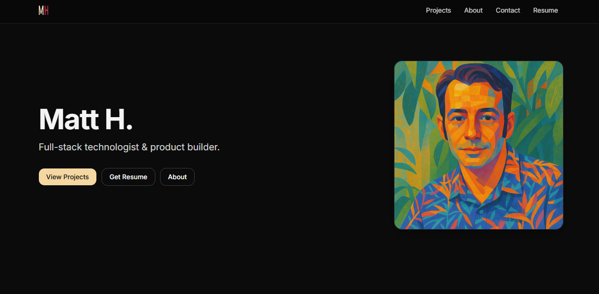

# whoami — Portfolio for Matt H.

A fast, privacy-centric portfolio site built with **Next.js App Router** and **Tailwind CSS**, deployed to **Cloudflare Pages** for edge performance.  
Dark theme with warm sand accents, accessible motion and focus, and clean project presentation.

---

### Live Site
[whoami.slightlyprivate.com](https://whoami.slightlyprivate.com)

---

### Preview of whoami


---

### Tech Stack
- **Frontend:** Next.js (App Router) · TypeScript · Tailwind CSS · `next/font` (Inter, JetBrains Mono)
- **Infra & Deploy:** Cloudflare Pages · `@cloudflare/next-on-pages` · Wrangler CLI
- **Analytics:** Optional self-hosted Umami (privacy-respecting)
- **Assets:** Static media and resume PDF served from `/public`

---

### Local Development
```bash
# Requirements
Node 18+ and npm

# Install dependencies
npm install

# Run locally
npm run dev
# → http://localhost:3000

# Build & start production bundle
npm run build && npm run start
```

---

### Page Structure
| Path | Description |
|------|--------------|
| `/` | Home hero + highlights |
| `/projects` | Project cards sourced from `data/projects.ts` |
| `/about` | Bio and guiding values |
| `/contact` | Email + social links |
| `/resume` | Serves `/public/resume.pdf` with HTML fallback |
| `/privacy` | Basic privacy page |
| `/sitemap.xml` | Built via `app/sitemap.ts` |
| `/robots.txt` | Static in `/public/` |

---

### Accessibility
- High-contrast dark palette (`#0B0B0C` background · `#F4D7A1` accent)  
- Skip-to-content link, visible focus rings, reduced-motion safe transitions  
- Semantic headings and landmark regions  

---

### Analytics (Optional)
If you use Umami analytics, set these environment variables:

| Variable | Purpose |
|-----------|----------|
| `NEXT_PUBLIC_UMAMI_WEBSITE_ID` | Your Umami website ID |
| `NEXT_PUBLIC_UMAMI_SRC` *(optional)* | Script URL, defaults to `https://umami.slightlybetter.dev/fetch.js` |

> The script loads after interactive and does not block rendering.  
> If unset, no analytics are loaded.

---

### Cloudflare Deployment
This project is configured for **Cloudflare Pages (Edge)** using `@cloudflare/next-on-pages`.

**Common scripts**
```bash
# Build for Pages (Edge)
npm run cf:build

# Local Edge preview
npm run cf:dev   # → http://localhost:8788

# Deploy to your Cloudflare Pages project
npm run cf:deploy
```

Setup summary:
1. `npx wrangler login`
2. Create a Pages project (`npx wrangler pages project create`)
3. `npm run cf:build && npm run cf:deploy`

Notes:
- Outputs a fully edge-ready bundle in `.vercel/output`.
- Avoid Node-only APIs at runtime; for metadata like resume mtime, compute at build-time or set `NEXT_PUBLIC_RESUME_UPDATED`.

---

### Notes
- Replace `public/og.png` and `public/favicon.ico` with final assets.
- Replace `public/resume.pdf` with your actual resume.
- See `cloudflare-pages.md` for recommended headers and caching policies.

---

> _Built quietly, deployed deliberately._  
> © Matt H. · Slightly Private
